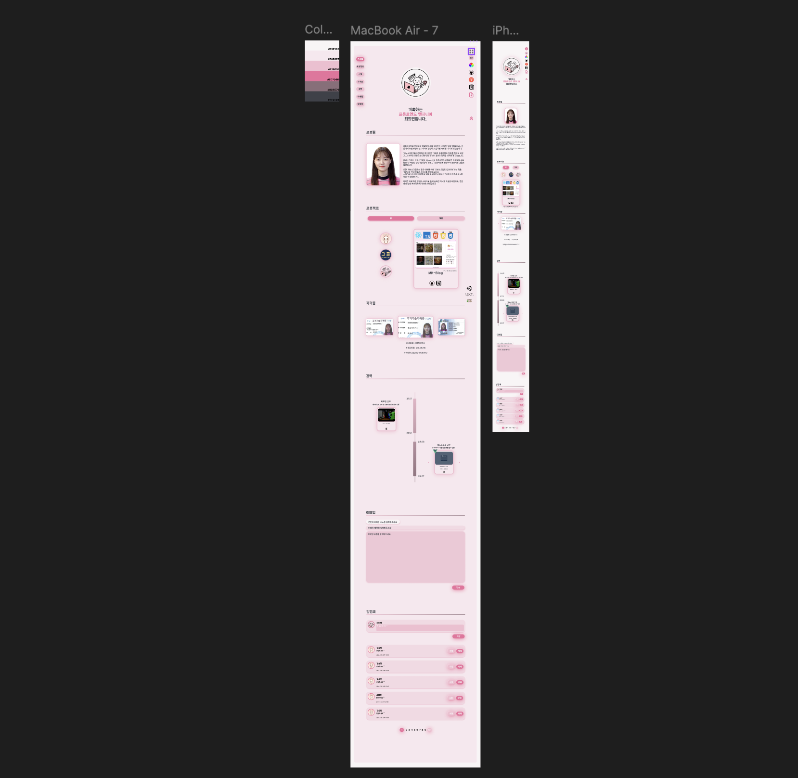

## 🌸 공감과 이야기가 피어나는 블로그

> 사람들이 댓글과 게시글을 통해 생각과 이야기를 나누고, 사용자 프로필 및 게시글을 손쉽게 관리할 수 있도록 설계된 **사용자 중심의 블로그 플랫폼**입니다.

---

## 📚 목차

- [🖥 서버 구조](#-서버-구조)
- [💻 화면 설계](#-화면-설계)
- [⚙️ 기술 스택](#-기술-스택)
- [🪄 프로젝트 상세 과정](#-프로젝트-상세-과정)
- [🛠 주요 화면 소개](#-주요-화면-소개)
  > [화면 0: 메인 화면](#화면-0-메인-화면)  
  > [화면 1: 회원가입 / 로그인 / 비밀번호 찾기 / 로그아웃 / 회원탈퇴](#화면-1-회원가입--로그인--비밀번호-찾기--로그아웃--회원탈퇴)  
  > [화면 2: 개인 블로그](#화면-2-개인-블로그)  
  > [화면 3: 게시글 작성 / 임시저장 / 수정](#화면-3-게시글-작성--임시저장--수정)  
  > [화면 4: 게시글 상세](#화면-4-게시글-상세)  
  > [화면 5: 인기글 / 최신글 / 태그 별 게시글 전체보기](#화면-5-인기글--최신글--태그-별-게시글-전체보기)  
  > [화면 6: 팔로우 / 팔로워](#화면-6-팔로우--팔로워)  
  > [화면 7: 실시간 알림 / 헤더에 알림 5개보기 / 알림 전체보기](#화면-7-실시간-알림--헤더에-알림-5개보기--알림-전체보기)  
  > [화면 8: 프로필 설정](#화면-8-프로필-설정)  
  
- [👥 팀원 소개](#-팀원-소개)

---

## 🖥 서버 구조

---

## 💻 화면 설계

 (https://www.figma.com/design/oLBgJllzx29LyORdwuDxPy/%EB%B8%94%EB%A1%9C%EA%B7%B8?node-id=0-1&t=WHfwLbrHGKrM6WwB-1)

---

## ⚙ 기술 스택

<table>
        <tr>
            <th>분류</th>
            <th>스택</th>
        </tr>
        <tr>
            <td><strong>Frontend</strong></td>
            <td>
            
                
            </td>
        </tr>
        <tr>
            <td><strong>Backend</strong></td>
            <td>
            
                
                
            </td>
        </tr>
        <tr>
            <td><strong>Database</strong></td>
            <td>
                
                
                
                
            </td>
        </tr>
  </table>

---

## 🪄 프로젝트 상세 과정

[Notion 으로 이동하여 프로젝트 상세 과정 보기](https://heeyeon9578.notion.site/MK-Blog-24-03-17-24-09-30-e5d9f108063d42fc82e5a6a7d423a596)

---

## 🛠 주요 화면 소개

### 화면 0: 메인 화면

- **메인 페이지**: 
  

    
메인 페이지

    
    

     - 헤더, 메인, 푸터로 구성되어 있습니다.
     - 메인에는 인기글, 최신글이 3개씩 자동으로 다음 데이터로 넘어가고 있습니다.
     - 지금 시간대의 이전 시간대 인기 태그 10개가 도출됩니다. 이때, 10개가 채워지지 않는다면 대체 태그(랜덤 태그)가 회색으로 도출됩니다.
     - 이번주 최다 팔로워 목록이 10명 도출됩니다. 이때, 10명이 채워지지 않는다면 대체 유저(랜덤 유저)가 회색으로 도출됩니다.
       

  

---

### 화면 1: 회원가입 / 로그인 / 비밀번호 찾기 / 로그아웃 / 회원탈퇴

- **회원가입**: 사용자가 조건에 맞는 아이디(실존하는 이메일), 인증번호, 비밀번호, 닉네임을 입력하여 회원가입하거나, 구글 아이디를 통해 회원가입합니다.

   

    
회원가입 페이지

     
    

    > 회원가입 버튼을 누르면, 계정 또는 구글로 회원가입할 수 있는 버튼이 도출됩니다. 
 
  

  

    
로컬 회원가입 페이지

    
    
  
    > 아아디로 사용할 이메일을 입력 후, 인증번호 전송을 클릭하면 해당 이메일로 인증번호가 전송됩니다.
    
    
  
    > 이메일로 받은 인증번호입니다.
    
     
  
    > 이메일 인증, 사용할 비밀번호, 닉네임의 조건을 모두 만족하면 회원가입 버튼이 disable -> able 상태가 되어 클릭할 수 있습니다.
 
  

   

    
구글 회원가입 페이지

     
    

    > 구글 아이디를 클릭하여 해당 서비스에 회원가입할 수 있습니다.
    
    

    > 닉네임 설정 페이지가 도출되며, 입력한 닉네임으로 활동하게 됩니다. 추후에 수정할 수 있습니다.
  
  

- **로그인**: 사용자가 회원가입할 때 사용한 아이디(이메일)과 비밀번호를 통해 로그인합니다.

  

    
로그인 페이지

     
    

    > 로그인 버튼을 누르면, 계정 또는 구글로 로그인할 수 있는 버튼이 도출됩니다. 
 
  

  

    
로컬 로그인 페이지

    
    
  
    > 로컬 회원가입때 사용한 이메일과 비밀번호를 입력하여 로그인합니다.

  

   

    
구글 로그인 페이지

     
    

    > 구글 아이디를 클릭하여 해당 서비스에 회원가입할때 사용한 이메일로 로그인할 수 있습니다.
    
  

- **비밀번호 찾기**: 사용자가 비밀번호를 잊어버렸을 경우, 가입한 이메일을 통해 새로운 비밀번호 인증코드를 받아 로그인할 수 있습니다.
  
  

    
비밀번호 찾기 페이지

   

    > 비밀번호를 찾고 싶은 아이디를 입력 후 인증번호 전송버튼을 클릭합니다.

    

    > 해당 이메일로 발송된 메일에 쓰여있는 임시 비밀번호를 사용하여 임시 로그인합니다.

  

- **로그아웃**: 사용자가 서비스에서 로그아웃 버튼을 클릭하여 로그아웃합니다.

- **회원 탈퇴**: 사용자가 서비스를 탈퇴하여 개인정보를 삭제합니다.
  
  

    
로컬 회원 탈퇴 페이지

    

    > 로그인할 때 사용한 이메일과 비밀번호 및 비밀번호 확인란을 조건에 맞게 채우면 회원 탈퇴하기 버튼이 활성화됩니다.
    
     
구글 회원 탈퇴 페이지

    

    > 로그인할 때 사용한 이메일과 비밀번호 및 비밀번호 확인란을 조건에 맞게 채우면 회원 탈퇴하기 버튼이 활성화됩니다.

  

---

### 화면 2: 개인 블로그 

- **개인 블로그 메인 페이지**: 
  

    
개인 블로그 메인 페이지

    
     

    > 내 블로그 페이지로 좌측 프로필 부분은 화면을 스크롤 하더라도 같이 움직입니다.
    
  

- **개인 블로그 관리 페이지(게시글 관리/카테고리 관리)**:

  

    
게시글 관리 페이지

    
    

    - 내 게시글을 관리할 수 있는 페이지로, 각자 자신의 게시글만 수정 또는 삭제할 수 있습니다.
     
   

   
     

       
    
카테고리 관리 페이지

    
    

    - 내 카테고리를 관리할 수 있는 페이지로, 각자 자신의 카테고리만 수정 또는 삭제할 수 있습니다.
    - 카테고리는 2개의 레벨로, 하위 카테고리는 사용자의 **드래그엔 드롭**을 통해 다른 상위 카테고리로 옮길 수 있습니다.
    - 최상위 카테고리에 하위 카테고리 존재 시 삭제할 수 없습니다.
    - 하위 카테고리에는 하위 카테고리를 추가할 수 없습니다.
  
  

---

### 화면 3: 게시글 작성 / 임시저장 / 수정 

- **게시글 작성 페이지**: 
  

    
게시글 작성 페이지

    
     

     - 게시글을 작성할 수 있는 페이지로, 카테고리 / 태그 / 공개여부 / 제목 / 내용을 설정 및 작성할 수 있습니다.
     - 게시글은 30초마다 자동 임시저장 됩니다.
     - 임시저장 목록에서 지금까지 임시 저장된 글들을 확인하고 이어서 작성할 수 있습니다.
     - 처음 게시글 작성 페이지에 들어가면 마지막으로 임시저장된 글을 이어서 작성할 것인지 묻습니다.
    
  

  

    
게시글 자동 임시저장 페이지

    
     

    
  

  

    
게시글 임시저장 목록 페이지

    
     

    
    
  

---

### 화면 4: 게시글 상세 

- **게시글 상세 페이지**:
  
  

    
게시글 상세 페이지

    
     

     - 게시글 목록에서 특정 게시글을 클릭하면 상세 페이지로 이동합니다.
     - 게시글의 제목, 내용, 카테고리, 작성자, 작성일자, 수정일자, 공감 수(당근 수), 조회수, 댓글 수 등이 조회됩니다.
     - 게시글의 끝에는 해당 게시글의 태그들이 보여집니다.
     - 자신의 게시글일 경우, 수정/삭제 버튼이 도출됩니다.
     - 이때, 태그를 클릭하면 해당 태그를 사용한 게시글들을 보여주는 페이지로 이동합니다.
     - 로그인한 사용자는 공감(당근)을 클릭하여 공감하거나 취소할 수 있습니다.
     - 댓글은 등록순 또는 인기순으로 조회할 수 있습니다.
     - 댓글을 작성하거나 답글을 작성할 수 있습니다.
     - 댓글/답글은 로그인한 사용자만 작성할 수 있습니다.
     - 자신의 댓글이나 답글일 경우 수정 또는 삭제할 수 있습니다.
    
  

---

### 화면 5: 인기글 / 최신글 / 태그 별 게시글 전체보기

- **인기글 / 최신글 전체보기 페이지**: 
  

    
인기글 / 최신글 전체보기 페이지

    
     

     - 메인화면에서 인기글이나 최신글의 전체보기 버튼을 클릭하면, 해당 정렬에 맞게 전체 게시글이 조회되는 페이지로 이동합니다.
     - 맨 아래에 페이지네이션을 두어 다른 패이지로 쉽게 이동할 수 있습니다.
     - 각 게시글을 클릭하여, 게시글 상세 페이지로 이동할 수 있습니다.
     - 검색 기능을 통해 검색을 할 수 있습니다.
      

  

   

- **검색 페이지**:
  

    
검색 페이지

    
     

     - 검색창에 검색 후 해당 단어가 진한 핑크색으로 표기되며, 해당 단어가 들어간 게시글들을 조회한 페이지가 보여집니다.
      

  

- **태그 별 검색 페이지**:
  

    
태그 별 검색 페이지

    
     

     - 메인화면의 인기 태그 혹은 각 게시글의 상세 페이지에서 태그를 클릭하면, 해당 태그를 사용한 게시글 목록을 조회합니다.
      

  

---

### 화면 6: 팔로우 / 팔로워

- **팔로우 페이지**: 

  

    
팔로우 페이지

    
    

     - 해당 프로필의 팔로우 목록이 조회됩니다.
     - 팔로우 목록은 무한 스크롤로, 스크롤을 통해 데이터를 지속적으로 조회할 수 있습니다.
     - 나의 팔로우 목록일 경우 '관리하기 버튼'이 도출되며, 클릭하면 각 팔로우를 삭제할 수 있는 버튼이 도출됩니다.
     - 서로 팔로우된 관계라면, 각 팔로우 왼쪽 위에 서로 팔로우 표시가 뜹니다.

  

- **팔로워 페이지**: 

  

    
팔로워 페이지

    
    

     - 해당 프로필의 팔로워 목록이 조회됩니다.
     - 팔로워 목록은 무한 스크롤로, 스크롤을 통해 데이터를 지속적으로 조회할 수 있습니다.
     - 팔로워마다 아래 팔로우할 수 있는 버튼이 존재합니다. 해당 버튼을 클릭하여 즉각적인 팔로우 또는 팔로우 취소를 진행할 수 있습니다.
     - 서로 팔로우된 관계라면, 각 팔로우 왼쪽 위에 서로 팔로우 표시가 뜹니다.

  

  
---

### 화면 7: 실시간 알림 / 헤더에 알림 5개보기 / 알림 전체보기 

- **알림 페이지**:
  

    
실시간 알림 페이지

    
    

     - 블로그 내의 모든 페이지에서 실시간 알림을 받을 수 있습니다.
     - 알림은 새 팔로워, 내가 팔로워한 사용자가 작성한 새 게시글, 나의 게시글에 달린 댓글, 내가 쓴 댓글에 달린 답글, 내 게시글에 좋아요(당근) 일 경우 발생합니다.
     - 실시간 알림은 최상단 우측에 뜹니다. 

  

   

    
헤더의 알림 페이지

    
    

     - 헤더에 벨모양 버튼을 클릭하면 최신 알림 5개를 확인할 수 있습니다.
     - 실시간 알림을 통해 받은 알림을 확인하면 벨모양이 다시 원상복귀 합니다.
     - 삭제 버튼을 통해 삭제하면 이전 알림이 보여집니다.

  

   

    
알림 전체보기 페이지

    
    

     - 모든 알림을 확인할 수 있습니다.
     - 알림의 종류별로 확인할 수 있습니다.
     - 하단의 페이지네이션을 통해 원하는 페이지로 쉽게 이동할 수 있습니다.
     - 알림을 삭제할 수 있습니다.
     - 각 알림을 클릭하면, 해당 알림에 해당하는 내용으로 이동합니다. 팔로워 알림은 해당 유저의 블로그로, 새 게시글일 경우 해당 게시글로, 댓글일 경우 해당 댓글로 이동합니다.
       

  

---

### 화면 8: 프로필 설정

- **프로필 설정 페이지**: 
  

    
프로필 설정 페이지

    
    

     - 프로필 이미지, 닉네임, 비밀번호(로컬 로그인일 경우에만), 상태 메시지를 설정할 수 있습니다.
       

  

---

## 👥 팀원 소개

|                   프론트엔드 개발                   |                    백엔드 개발                    |
| :-------------------------------------------------: | :-----------------------------------------------: |
|  |  |
|    **[최희연](https://github.com/heeyeon9578)**     |      **[정예지](https://github.com/xEzIxX)**      |

---
